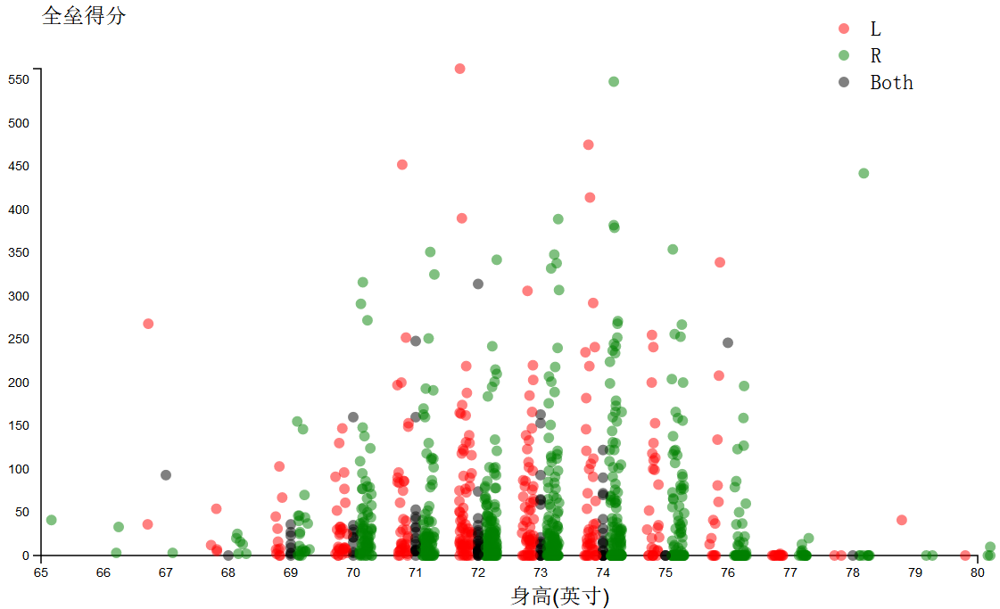

# 使用D3来实现的棒球队员的数据分析可视化

## 总结

从数据中得到这样结论：**身高和体重居中且右手习惯的运动员 的全垒打得分中相对偏高**。

主要看图

另外，从图中也能看出有以下问题

- 体重统计不精确，部分数据明显是以10的倍数归过类的，而部分数据没有归类。
- 击球率2级分化验中，差得是0，好的均值在0.22左右，说明可能有选手是不参与击球的

## 设计

初步分析数据, 每个人的属性并不多，有两种。

其中自身属性3个：用手习惯，身高，体重。另外 成绩属性2个：击球率，全垒得分

可见，数据分析的主要目的是 探索 成绩 和 运动元身体属性之间的关系

于是我这样规划。

- 采用**散列点图**的方式
- 分别将 身高 和 体重作为横坐标
- 分别将 击球率 和 全垒得分作为纵坐标
- 用手习惯作为 颜色编码的方式

分别探索4组数据，并且展示他们之间的动画，同时对散列点图做些美化

## 反馈

### 用户1：

**1. 你在这个可视化中注意到什么**
    
身高和 体重位于中间的运动员，普遍成绩更高
不轮左右手习惯表现差不多

**2. 你对这个数据有什么问题吗？**

没有体现出击球率和全垒得分之间的关系

**3. 你觉得这个可视化主要表达了什么？**

没有表达什么

**4. 这个图形中你有什么不明白的地方吗？**

没有不明白的地方

### 用户2：

**1. 你在这个可视化中注意到什么**

注意到了右手运动员的表现在高全垒打得分普遍比较高

**2. 你对这个数据有什么问题吗？**

为什么有些运动员击球率为0，而有些很好，之间缺乏过度，这个很不正常，是否有其他因素没有考虑进去

**3. 你觉得这个可视化主要表达了什么？**

表达了 身高体重 和 成绩之间的关系

**4. 这个图形中你有什么不明白的地方吗？**

身高和体重的单位不知道，击球率和全垒打得分的单位不知道

### 用户3：

**1. 你在这个可视化中注意到什么**

注意到了大家的击球率普遍都很高

**2. 你对这个数据有什么问题吗？**

体重数据有问题，明显160,170,180,190,200,210等整数的运动员不较多，而也有散开的。
说明身高的收集数据的时候，部分数据是归了类的，部分数据是没有归类的。

**3. 你觉得这个可视化主要表达了什么？**

表达了身高体重和成绩之间的关系

**4. 这个图形中你有什么不明白的地方吗？**

刻度没有说明单位，不清楚。 HR也不知道是什么意思。

## 资源

这里是 [资源文件](baseball_data.csv)

这是一个包含 1,157 名棒球手的数据集，包括他们的用手习惯（左手还是右手）、身高（英寸）、体重（磅）、击球率和全垒得分。

数据字段说明：

- name  棒球手名字
- handedness 用手习惯，L表示左手，R表示右手
- height 身高（英寸）
- weight 体重（磅）
- 击球率 
- 全垒得分